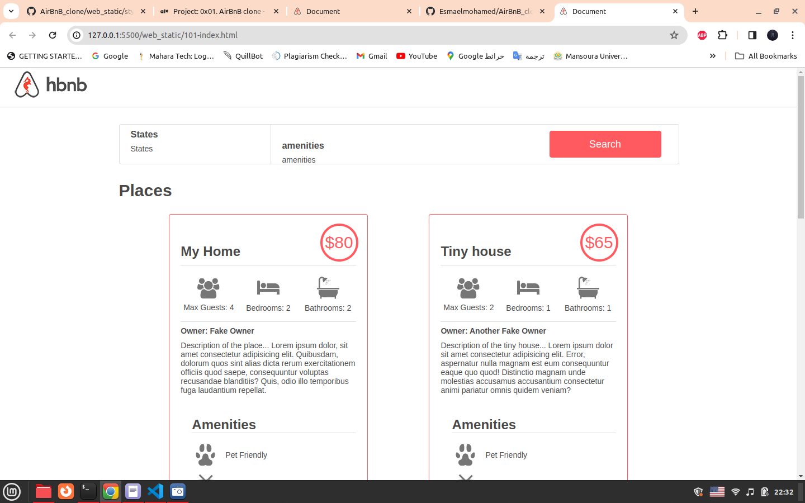
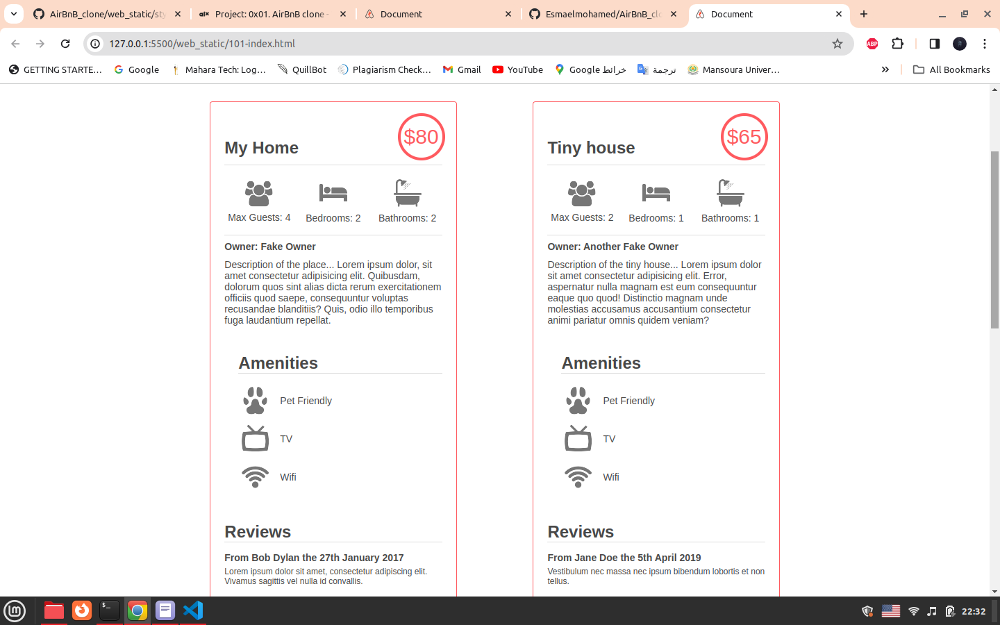

# HBnB (HomeBnB) Project

HBnB (HomeBnB) is a project aimed at creating a simplified version of the Airbnb platform, allowing users to manage and book accommodations. The project consists of a command-line interface (CLI) for managing data and interacting with the system.

## Command Interpreter

### How to Start

To start the HBnB command interpreter, follow these steps:

1. Clone the HBnB repository to your local machine.
2. Navigate to the root directory of the project.
3. Run the `console.py` file using Python 3.

```bash
python3 console.py

How to Use
Once the command interpreter is started, you can interact with it using various commands. Here are the available commands and their usage:

create: Create a new instance of a class. 
(hbnb) create BaseModel

show: Display the string representation of an instance. 
(hbnb) show BaseModel 1234-5678

destroy: Delete an instance based on the class name and ID.
(hbnb) destroy BaseModel 1234-5678

all: Display all instances of a class.
(hbnb) all BaseModel

update: Update an instance with new information.
(hbnb) update BaseModel 1234-5678 name "New Name" 
```

# Airbnb Clone HTML & CSS Project Process in webstatic folder 

## 1. Project Setup
- Set up project directory and files.
- Created `index.html` as main entry point.
- Created CSS files for styling.

## 2. HTML Structure
- Defined basic HTML structure with `<!DOCTYPE html>` declaration.
- Added `<head>` section with metadata (charset, viewport, title) and links to CSS files.
- Structured `<body>` section with header, main content, and footer.

## 3. Header Section
- Designed header section with Airbnb logo using `` tag.
- Styled header with CSS for alignment and appearance.

## 4. Main Content - Filters Section
- Created filters section containing search button, locations, and amenities.
- Styled filters section using CSS with flexbox for layout and appearance.
- Implemented hover effects and popover functionality using CSS.

## 5. Main Content - Places Section
- Designed places section to display rental listings.
- Utilized flexbox for grid-like layout of listings.
- Styled each place listing including title, price, information, user details, description, amenities, and reviews.
- Used absolute positioning for certain elements.

## 6. Footer Section
- Created simple footer with text "Best School".
- Styled footer for alignment and appearance.

## 7. Responsive Design
- Ensured page layout adapts to different screen sizes using relative units, flexbox, and media queries.
- Adjusted widths, heights, margins, and paddings for cohesive design across devices.
- Ensured readability and usability on smaller screens.

## 8. Testing and Refinement
- Tested webpage on different devices and screen sizes.
- Made necessary adjustments to CSS and HTML to fix layout issues.
- Refactored code for better organization, readability, and maintainability. 




